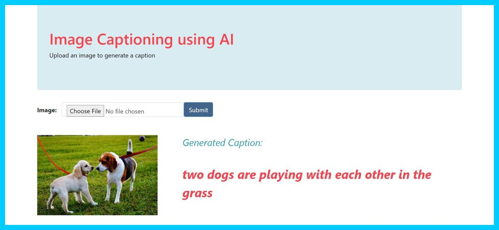
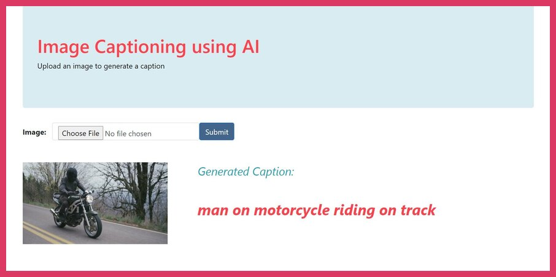
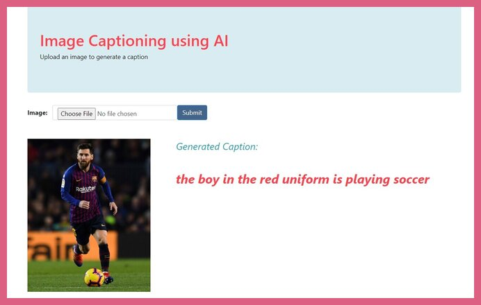

# Image Captioning Bot

### Snapshots
 

 

 

 

 

### Applications
<ol>
  <li><b>Visual Aid for the blind</b></li>
  <li><b>CCTV Monitoring</b>- generate captions at regular intervals and raise alarms in case of malicious activity. Helps in reduction of crimes and accidents</li>
  <li><b>Automatic Image Captioning for Google Search</b> to search a similar image on Google Search using the generated Text Query for better results</li>
  </ol>

### Dataset Used: 

 <a href="https://www.kaggle.com/shadabhussain/flickr8k">Flick8K Dataset</a> Contains 8000 images with 5 captions describing each image

